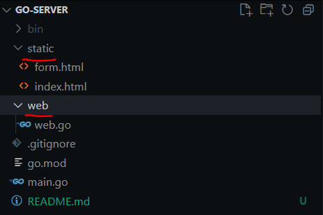

## Simple Go-Server Using net/http package:

Directory Structure:

It has two folders namely :

1. static : it contains static html pages like index.html and form.html
2. web: this is a go package containing logic for routing i.e handler functions for "/" and "/form" routes.
